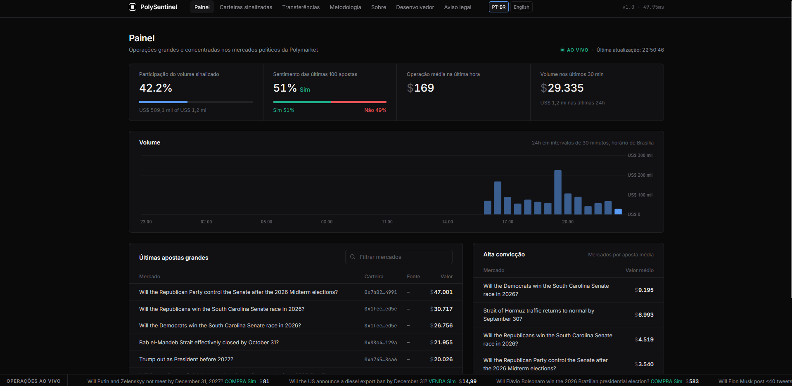
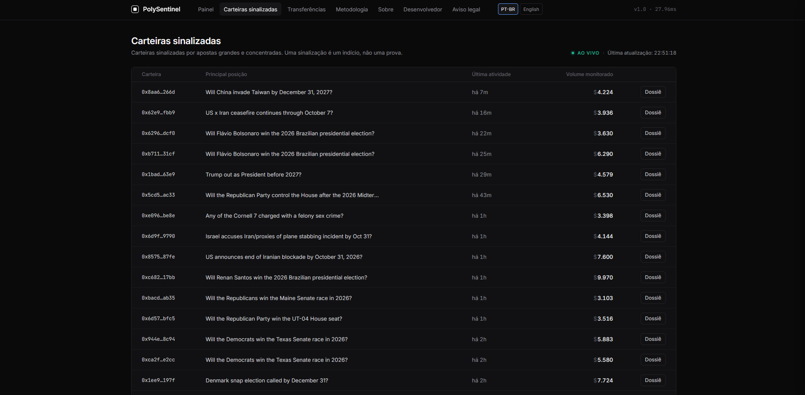
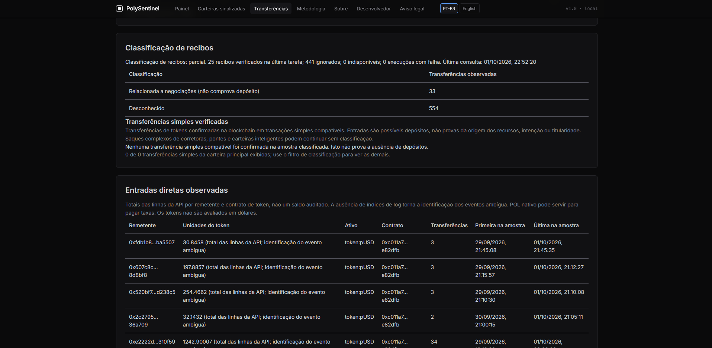
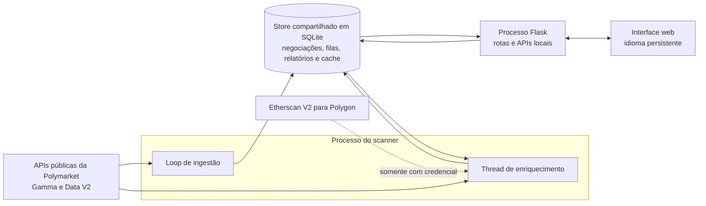

# PolySentinel

O PolySentinel monitora mercados políticos na Polymarket e destaca atividades de negociação incomuns. Os alertas se baseiam no volume observado das negociações; eles não comprovam informação privilegiada, identidade nem conduta ilícita.

## Funcionalidades atuais

- Painel em tempo real com grandes negociações, gráficos de volume e sentimento baseado em atividade.
- Dossiês de carteiras sinalizadas com as negociações recentes rastreadas.
- Explorador de transferências com evidências salvas, investigações limitadas na Polygon, classificação de recibos e exportação em JSON.
- Alternância entre inglês e português brasileiro em todas as páginas, inclusive Sobre, Desenvolvedor e Aviso legal. Apenas um idioma é renderizado por vez, e a escolha persiste durante a navegação.
- Armazenamento durável em SQLite, ingestão segura contra reprocessamento, enriquecimento em segundo plano e estados explícitos de resultado parcial ou erro.

O explorador de transferências não detecta identidades nem comprova a origem final dos recursos. Recibos relacionados a negociações permanecem separados dos candidatos verificados de transferência simples. Um relatório vazio ou parcial não prova que uma carteira nunca recebeu recursos.

## Visão da interface

### Painel



### Carteiras sinalizadas



### Explorador de transferências



Capturas da interface atual em PT-BR, fornecidas em 1º de outubro de 2026. Os valores representam o momento da captura, não dados em tempo real. O exemplo de transferências mostra cobertura parcial; categorias desconhecidas e ausência de depósitos verificados não comprovam ausência de financiamento.

## Arquitetura



A ingestão de negociações e o enriquecimento são executados separadamente no scanner. Ambos compartilham o mesmo `Store` SQLite usado pelo servidor Flask. As APIs públicas da Polymarket alimentam a ingestão sem credenciais; a Etherscan V2 só participa das investigações e classificações quando `ETHERSCAN_API_KEY` está configurada.

## Execução local

O CI usa Python 3.12. O Node.js 22 é usado nos testes de frontend, mas não é necessário para executar a aplicação. Rode os comandos a partir do diretório do repositório.

```powershell
python -m venv .venv
.\.venv\Scripts\python.exe -m pip install -r requirements-dev.txt
if (-not (Test-Path .env)) { Copy-Item .env.example .env }
.\.venv\Scripts\python.exe server.py
```

Em outro terminal:

```powershell
.\.venv\Scripts\python.exe PolyInsideScanner.py
```

Acesse http://127.0.0.1:5000. Os dois processos devem usar o mesmo caminho em `SENTINEL_DB`. Caminhos relativos são resolvidos a partir do diretório do repositório. O servidor web inicializa um banco de dados vazio independentemente do scanner.

Os dados públicos do painel da Polymarket não exigem chave de API. Investigações de transferências e classificação de recibos exigem `ETHERSCAN_API_KEY` no arquivo `.env` local, com acesso à Polygon pela Etherscan V2, cadeia 137. Uma chave antiga da PolygonScan não equivale a uma chave da Etherscan V2. Não forneça chave privada de carteira, frase-semente nem credenciais de negociação. Reinicie os dois processos após alterar o `.env`. Credenciais ausentes ou incompatíveis são informadas explicitamente; consultas com falha não apagam silenciosamente evidências salvas.

| Variável | Padrão | Finalidade |
| --- | --- | --- |
| `SENTINEL_DB` | `data/sentinel.sqlite3` | Banco de dados SQLite unificado |
| `POLL_SECONDS` | `15` | Intervalo de consulta do scanner |
| `LOOKBACK_SECONDS` | `600` | Histórico solicitado para um banco novo |
| `ETHERSCAN_API_KEY` | vazio | Consultas opcionais de transferências e recibos na Polygon |

### Como verificar se está funcionando

Acesse `/healthz` para verificar o servidor web, o banco de dados e o estado do scanner. O painel só exibe `AO VIVO` depois de uma consulta bem-sucedida do scanner nos últimos 90 segundos. Uma página web funcionando, por si só, não significa que a ingestão esteja ativa.

Se os dados estiverem desatualizados, confirme que `PolyInsideScanner.py` está em execução e examine a saída do terminal. Se uma investigação permanecer na fila, mantenha o scanner ativo; o servidor web não processa tarefas em segundo plano. Verifique o acesso ao endpoint da Polygon se o relatório indicar que ele não é compatível. Quando os resultados forem parciais, consulte os campos de cobertura e avisos em vez de interpretar linhas ausentes como evidência negativa.

## Docker

```sh
docker compose up --build -d
docker compose logs -f scanner
```

O Compose executa o scanner e o servidor web Gunicorn separadamente, compartilhando um volume nomeado para o banco. A porta do painel fica vinculada ao localhost. O Docker é adequado para monitorar o painel, mas os pares da rede bridge do Docker são rejeitados de propósito pelas rotas de investigação restritas ao ambiente local. Para investigações interativas de transferências, execute os dois processos Python localmente. O servidor Flask embutido destina-se ao desenvolvimento local. O acesso público às investigações não está implementado: HTTPS e proxy reverso, isoladamente, não substituem autenticação, autorização e limites por usuário.

## Higiene do repositório

Arquivos reais de ambiente, bancos de dados, backups em `data/`, logs, ambientes virtuais, configurações locais de IDE e arquivos comuns de credenciais são excluídos do Git. O `.env.example` é um modelo de configuração vazio, não um arquivo de credenciais. Também não inclua credenciais em capturas de tela, exportações JSON, relatos de problemas ou mensagens de commit.

Os arquivos-fonte e de configuração não contêm comentários de código. O README é documentação do projeto; mensagens de commit continuam fazendo parte do histórico do repositório. Regras de exclusão não removem informações já presentes em commits anteriores. Se uma credencial for commitada, revogue-a antes de considerar qualquer limpeza do histórico.

## Dados e detecção

O scanner pagina eventos ativos, atualiza a lista de mercados políticos a cada hora e solicita negociações públicas de tomadores de liquidez no valor mínimo de US$ 10. Cada negociação qualificada é persistida imediatamente. Condições desconhecidas são consultadas pelo identificador tanto em mercados abertos quanto encerrados. Classificações indisponíveis entram em uma fila pendente durável e são repetidas em lotes rotativos, mesmo depois de saírem da sobreposição de negociações. Condições reconhecidas como não políticas são excluídas. Condições que a API nunca resolver permanecem pendentes e podem aumentar o banco; não são excluídas silenciosamente. Uma janela móvel e inclusiva de 600 segundos sinaliza negociações individuais de pelo menos US$ 500 quando o valor combinado atinge US$ 3.000 para a mesma carteira, mercado, lado e resultado. Registros atrasados fazem as janelas afetadas serem recalculadas; negociações persistidas sobrevivem a reinicializações.

A inserção da negociação, os alertas de detecção e o progresso são confirmados em uma única transação. Falhas de validação, paginação incompleta e falhas de gravação não avançam o progresso. Consultas seguintes sobrepõem em 120 segundos o cursor persistido. Os eventos usam paginação por chave da Gamma filtrada por etiquetas políticas; as negociações usam paginação por cursor da Data API V2 com os mesmos filtros em todas as páginas. O feed global de negociações ignora limites de tempo no servidor, portanto o cliente percorre os registros do mais recente para o mais antigo até ultrapassar seu próprio limite histórico. Cursores repetidos, paginação inconsistente ou esgotamento do orçamento de requisições geram erro em vez de omitir histórico silenciosamente.

A identidade de uma negociação combina hash da transação, carteira, token, mercado, lado, resultado, horário, quantidade e preço. A API pública não expõe um índice de execução: execuções realmente distintas cujos campos de identidade sejam todos idênticos não podem ser diferenciadas e serão condensadas em um único registro. Registros atrasados mais antigos que a sobreposição podem exigir uma janela de reprocessamento maior. O feed global V2 expõe o mês-calendário atual e o anterior, portanto não recupera interrupções arbitrariamente antigas. A origem é um feed público de negociações de tomadores de liquidez, não um livro-razão completo e auditado nem uma garantia de volume de toda a corretora. Resultados vazios marcados explicitamente com índice 999 são mantidos como sem rótulo, com grupos de detecção separados para cada token.

O enriquecimento de perfil e portfólio das carteiras é executado separadamente da ingestão. Investigações de transferências são tarefas explícitas em segundo plano, processadas pela thread de enriquecimento do scanner sem bloquear a ingestão de negociações. A antiga consulta das dez primeiras transações nativas e os rótulos de corretoras sem fonte foram removidos. Uma indicação de remetente não comprova a origem final dos recursos.

## Explorador de transferências

Acesse `/transfers` ou escolha **Explorar transferências** no dossiê de uma carteira. O endereço antigo `/funding` permanece compatível. Este é um explorador de transferências observadas, não um detector de fonte de recursos ou identidade. **Abrir relatório** lê evidências salvas; **Investigar / atualizar** coloca uma investigação na fila. Requisições GET nunca consomem chamadas da API externa. O scanner precisa estar em execução para consumir as tarefas. Adicione `ETHERSCAN_API_KEY` ao `.env` local ignorado pelo Git, com acesso à Polygon pela Etherscan V2, e reinicie os dois processos. Uma chave antiga da PolygonScan, uma chave de API de negociação ou uma chave privada de carteira não servem como substitutas. A disponibilidade dos endpoints depende do plano da Etherscan; resultados incompatíveis e parciais são exibidos explicitamente.

As investigações coletam, dos registros mais recentes para os mais antigos, transações normais, transferências nativas internas e transferências ERC-20 na Polygon, cadeia 137. Os padrões são 100 linhas por página, duas páginas por fluxo, três saltos de origem, 12 estados de endereço e ativo, 30 chamadas HTTP e um prazo de 90 segundos para o percurso, verificado entre requisições. Uma requisição em andamento pode ultrapassar esse prazo porque as retentativas HTTP têm tempos-limite próprios. Páginas ausentes, limites de orçamento, linhas malformadas, índices de evento ausentes e falhas externas são informados, e não tratados como histórico completo. Transferências de valor zero são ignoradas; eventos de emissão e queima permanecem como evidência, mas não contam como financiadores externos. Transferências nativas de POL são observações de gás e não são usadas para vincular capital comum de negociação.

O percurso rumo à origem segue apenas transferências de entrada do mesmo contrato de token anteriores ao horário da transferência seguinte. Valores e horários compatíveis não comprovam que determinados recursos fungíveis financiaram uma aposta. Transferências de saída observadas nas proximidades permanecem na tabela de evidências, não na visualização do caminho de origem. Infraestrutura verificada da Polymarket interrompe o percurso; os rótulos incluem a fonte na documentação oficial. Carteiras desconhecidas de corretoras, pontes, mixers, spam de tokens e serviços compartilhados não são identificados automaticamente. Símbolos de tokens são metadados não confiáveis. Strings decimais exatas preservam a precisão das unidades do token; totais de linhas da API sem índices de log são marcados como ambíguos, não apresentados como livro-razão auditado nem valor em dólares.

Os relatórios persistem após reinicializações. Atualizações parciais ou com falha mesclam novas evidências às observações antigas em vez de apagá-las; arestas mantidas preservam o horário e a geração em que foram observadas. Somente uma resposta limitada e concluída substitui o retrato anterior. Tarefas interrompidas são recuperadas depois de uma concessão de dez minutos, e processos antigos não podem sobrescrever uma geração mais recente. A versão 3 do esquema adiciona transacionalmente um cache de recibos e uma fila de classificação sem alterar negociações, observações de transferências nem o progresso do scanner já existentes.

### Classificação de recibos

Escolha **Classificar transferências salvas** para examinar os recibos das observações existentes sem buscar outra amostra de transferências. Novas investigações concluídas também solicitam classificação quando a fila e o orçamento compartilhados permitem. As tarefas de recibos usam as mesmas verificações de loopback real e mesma origem, limite de dez tarefas pendentes, cota de 30 novas requisições por 24 horas e intervalo de dez minutos por carteira. A cota de 30 requisições soma tarefas de investigação e classificação, inclusive classificações automáticas. Cada tarefa de classificação processa até 500 hashes de transação amostrados, prioriza observações no nível raiz e faz no máximo 25 novas consultas de recibo dentro de um prazo de 90 segundos. Recibos verificados são reutilizados por uma hora; recibos restantes ou indisponíveis são contabilizados explicitamente. Uma tarefa parcial não consome outra cota automaticamente. Uma solicitação posterior pode avançar pelos registros em cache até o próximo subconjunto ainda não consultado.

Recibos bem-sucedidos precisam coincidir com o hash de transação esperado, a identidade do bloco e índices de log únicos. Logs removidos, transações malsucedidas, campos malformados e metadados de bloco inconsistentes não podem sustentar candidatos a depósito. Observações ERC-20 são comparadas com exatidão aos campos de contrato, origem, destino e valor bruto dos logs. Uma identidade `(137, hash da transação, índice do log)` normaliza a evidência e os totais exibidos, eliminando linhas duplicadas da API sem descartar logs distintos de mesmo valor. As observações brutas de transferência nunca são excluídas pela classificação. Recibos ausentes ou sem correspondência permanecem desconhecidos. Recibos em cache são evidência histórica, não garantia de finalização da blockchain nem resultado criptograficamente verificado do provedor; recibos vencidos são rotulados e excluídos das ligações de transferência simples.

A categoria positiva compatível é **transferência simples verificada**, não origem inicial dos recursos. Ela exige um contrato de garantia pUSD ou USDC conhecido, unidades exatas e positivas do token, participação da carteira relevante, uma transação enviada pelo remetente da transferência diretamente ao contrato do token e exatamente um log que não seja de gás. Entradas são candidatas a depósito; saídas são candidatas a saque. Esses fatos não comprovam intenção, propriedade em comum nem a pessoa real por trás de um endereço. Tokens desconhecidos, movimentos apenas de gás, eventos de emissão ou queima, saques complexos de corretoras, pontes e operações incompatíveis de carteiras inteligentes não são promovidos a depósitos.

Eventos `OrderFilled` v2 verificados que envolvam a carteira relevante fornecem **contexto relacionado a negociações**. Eventos compatíveis de Conditional Tokens fornecem contexto de divisão, combinação ou resgate de posição. O classificador verifica endereços confiáveis dos contratos emissores, tópicos, formato ABI, participação da carteira e garantia; um tópico emitido por contrato arbitrário não é suficiente. O contexto não atribui de forma única cada transferência de uma transação mista a uma liquidação ou resgate. Eventos v1 antigos e operações de protocolo não reconhecidas permanecem desconhecidos. Somente transferências simples classificadas por recibo aparecem nas ligações de transferências simples; comparações brutas de relação entre contrapartes recebem rótulo separado e não são comparações restritas a depósitos.

Essa etapa classifica a amostra recente e limitada já existente. Ela não pesquisa depósitos durante toda a vida da carteira, verifica controladores de carteiras inteligentes, reconstrói conversões de protocolo ou continuidade entre pontes, nem identifica financiadores finais. Esses recursos exigiriam caminhos de evidência implementados e validados separadamente. A interface e o JSON exportado expõem categoria e motivo por aresta, identidade do log do recibo, horários de observação e cache, contagens das tarefas e lacunas de orçamento.

Sinais compartilhados de remetente e destino comparam observações ERC-20 no nível raiz entre investigações salvas cujos contratos de token coincidem. Eles excluem financiamento nativo, contrapartes de emissão e queima e infraestrutura conhecida, vinculam evidências de transação das duas carteiras e nunca afirmam propriedade em comum. A sobreposição temporal examina no máximo 500 negociações locais da carteira nos sete dias anteriores e procura o mesmo mercado, lado e resultado em até 120 segundos. São necessárias pelo menos três negociações raiz em dois mercados para exibir um candidato; isso descreve uma sobreposição, não é um teste de significância nem prova de coordenação. Apenas mercados varridos localmente são representados.

As investigações exigem simultaneamente um par de rede realmente em loopback, nome de host localhost ou loopback, requisições JSON de mesma origem e limites compartilhados duráveis de dez tarefas pendentes e 30 novas requisições por 24 horas, com intervalo de dez minutos por carteira. Cabeçalhos encaminhados não são confiáveis. Não exponha o serviço Flask local publicamente nem coloque um proxy sem autenticação à sua frente. Autenticação e autorização por usuário são obrigatórias antes de habilitar investigações em uma implantação pública. Pares da bridge do Docker são rejeitados de propósito pela rota exclusiva para ambiente local; execute os processos Python localmente até que uma implantação devidamente autenticada seja implementada. Nenhuma credencial privada de negociação é usada. A interface e a exportação mostram até 10.000 arestas salvas mais recentes e indicam claramente o corte; evidências mais antigas continuam no SQLite. Os limites de resultados de relação e tempo também são explícitos. Indicações antigas de remetentes são preservadas separadamente e rotuladas como não verificadas; investigações nunca as sobrescrevem com observações de transferências.

Endpoints: `GET /api/funding/<address>` lê um relatório salvo, `POST /api/funding/<address>` solicita uma tarefa e `GET /api/funding/<address>?download=1` exporta JSON. A API nunca identifica uma pessoa real, verifica o controlador de uma carteira ou rastreia entre redes. Pontes e conversões de protocolo são descontinuidades que exigem evidência verificada adicional, não ligações presumidas.

Especificações principais: [transferências ERC-20 na Etherscan](https://docs.etherscan.io/api-reference/endpoint/tokentx), [transferências internas](https://docs.etherscan.io/api-reference/endpoint/txlistinternal), [contratos da Polymarket](https://docs.polymarket.com/resources/contracts) e [tipos de carteira](https://docs.polymarket.com/trading/wallets-auth).

Especificações de recibos: [recibos na Etherscan](https://docs.etherscan.io/api-reference/endpoint/ethgettransactionreceipt), [eventos da exchange v2](https://github.com/Polymarket/ctf-exchange-v2/blob/main/src/exchange/interfaces/ITrading.sol), [eventos de Conditional Tokens](https://github.com/gnosis/conditional-tokens-contracts/blob/master/contracts/ConditionalTokens.sol) e [contratos nativos de USDC da Circle](https://developers.circle.com/stablecoins/usdc-contract-addresses). Os seletores de evento são hashes Ethereum Keccak-256 fixos, não hashes NIST SHA3-256.

O sentimento do painel considera `BUY Yes` e `SELL No` como altistas, e `BUY No` e `SELL Yes` como baixistas; outros resultados são excluídos dessas contagens. Essas são classificações de atividade, não previsões. O gráfico de velocidade usa 48 blocos de meia hora com horários explícitos. Atividade sinalizada e demais atividades são subconjuntos separados dos mesmos dados persistidos. `AO VIVO` exige uma consulta bem-sucedida do scanner nos últimos 90 segundos e estado íntegro do scanner.

## Bancos de dados existentes

Os arquivos originais `whale_hunter.db` e `insider_intel.db` são preservados localmente, mas excluídos de commits futuros. A aplicação refatorada usa um banco novo e não importa automaticamente agregados antigos. Registros antigos não têm uma identidade individual de negociação confiável e podem se sobrepor; importá-los para o novo livro-razão criaria risco de contagem duplicada. Mantenha esses arquivos como retratos históricos. O histórico existente do Git ainda os contém.

## Verificação

```powershell
.\.venv\Scripts\python.exe -m pytest -q
node --test tests/frontend.test.cjs tests/funding_frontend.test.cjs tests/localization.test.cjs
```

Os testes cobrem reprocessamento, empates de horário, execuções distintas em uma transação, reinicializações, negociações atrasadas, limites de janela, isolamento entre mercados e lados, reversão de transações, dados externos malformados, paginação, enriquecimento de carteiras, totais do painel, horários de gráficos, erros de API, renderização do frontend e recuperação na inicialização. Eles rodam offline e sem credenciais.

Os testes de localização cobrem todas as páginas, preferência de idioma salva, preservação de parâmetros de consulta, renderização de um único idioma, estados dinâmicos do painel e renderização inerte de texto não confiável. Perguntas dos mercados, endereços de contratos, unidades de tokens e evidências exportadas mantêm os dados originais.

`/healthz` verifica a disponibilidade do servidor web e do banco e informa o estado do scanner separadamente. Um servidor web íntegro não implica scanner ativo. `/api/stats`, `/api/insider_data` e `/api/whale/<address>` fornecem os dados do painel. Falhas no banco retornam HTTP 503; endereços de carteira malformados retornam HTTP 400.

## Estrutura

- `polysentinel/config.py`: configuração por variáveis de ambiente.
- `polysentinel/clients.py`: requisições validadas às APIs públicas e enriquecimento opcional.
- `polysentinel/storage.py`: esquema SQLite e ciclo de vida das conexões.
- `polysentinel/scanner.py`: normalização, ingestão transacional, consultas periódicas e enriquecimento.
- `polysentinel/detection.py`: alertas por janela de volume.
- `polysentinel/queries.py`: consultas do painel.
- `polysentinel/web.py`: fábrica da aplicação Flask e rotas.
- `polysentinel/provenance.py`: amostragem e percurso limitados de transferências na Polygon.
- `polysentinel/funding.py`: relatórios salvos, tarefas de investigação e comparações de relações.
- `polysentinel/receipts.py`: validação rigorosa de recibos e classificação do contexto de protocolo.
- `polysentinel/classification.py`: cache de recibos, tarefas de classificação e identidades normalizadas de eventos.
- `polysentinel/localization.py` e `static/localization.js`: traduções da interface renderizada pelo servidor e da interface dinâmica.
- `templates/` e `static/`: interface, estilos e comportamento do frontend.
- `tests/`: verificações de regressão offline do backend e do frontend.
- `PolyInsideScanner.py` e `server.py`: pontos de entrada executáveis.
