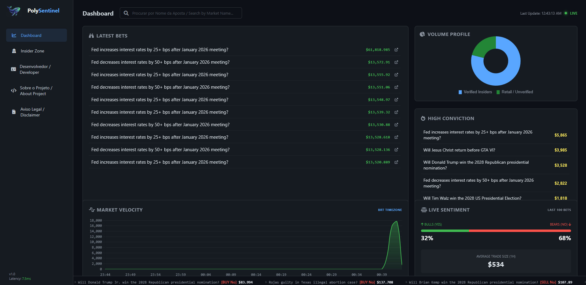

# PolySentinel

PolySentinel monitors political markets on Polymarket and highlights unusual trading activity. Flags are based on observed trade volume; they do not establish insider knowledge, identity, or misconduct.



The screenshots show the original interface and may differ from the current version.

## Run locally

Requires Python 3.10+ and Node.js 20+ for frontend tests.

```powershell
python -m venv .venv
.\.venv\Scripts\python.exe -m pip install -r requirements-dev.txt
Copy-Item .env.example .env
.\.venv\Scripts\python.exe server.py
```

In another terminal:

```powershell
.\.venv\Scripts\python.exe PolyInsideScanner.py
```

Open http://127.0.0.1:5000. Both processes must use the same `SENTINEL_DB` path. Relative paths resolve against the repository directory. The web server initializes an empty database independently of the scanner.

Public Polymarket data requires no API key. Optional funding enrichment uses `ETHERSCAN_API_KEY` in `.env`, with the Etherscan V2 API and Polygon chain ID 137. Existing PolygonScan keys are not interchangeable with Etherscan keys. Missing credentials leave funding information unknown. API errors preserve previously fetched information.

| Variable | Default | Purpose |
| --- | --- | --- |
| `SENTINEL_DB` | `data/sentinel.sqlite3` | Unified SQLite database |
| `POLL_SECONDS` | `15` | Scanner polling interval |
| `LOOKBACK_SECONDS` | `600` | History requested for a new database |
| `ETHERSCAN_API_KEY` | empty | Optional funding lookup |

## Docker

```sh
docker compose up --build -d
docker compose logs -f scanner
```

Compose runs the scanner and Gunicorn web server separately, sharing a named database volume. The dashboard port binds to localhost. To deploy publicly, configure HTTPS and a reverse proxy for the Gunicorn service. The built-in Flask server is for local development.

## Data and detection

The scanner paginates active events, refreshes its political market map hourly, and requests public taker trades worth at least $10. Each qualifying trade is persisted immediately. Unknown conditions are looked up by condition ID in both open and closed markets. Unavailable classifications enter a durable pending queue and are retried in rotating batches, even after falling outside the trade overlap. Known non-political conditions are excluded. Conditions that the API never resolves remain pending and can grow the database; they are not silently deleted. A rolling, inclusive 600-second window flags individual trades worth at least $500 when their combined value reaches $3,000 for the same wallet, market, side, and outcome. Late arrivals re-evaluate affected windows; persisted trades survive restarts.

Trade insertion, detection flags, and progress commit in one transaction. Failed validation, incomplete pagination, and failed writes do not advance progress. Subsequent polls overlap the persisted cursor by 120 seconds. Events use Gamma keyset pagination filtered by political tags; trades use Data API V2 cursor pagination with unchanged filters across pages. The global trade feed ignores server-side time bounds, so the client walks newest-first until it crosses its own history cutoff. Repeated cursors, inconsistent pagination, or an exhausted request budget produce an error rather than silently skipping history.

Trade identity combines transaction hash, wallet, token, market, side, outcome, timestamp, size, and price. The public API does not expose a fill index: genuinely distinct fills with every identity field identical cannot be distinguished and will collapse into one record. Delayed records older than the overlap can require a larger replay window. The global V2 feed exposes the current and previous calendar month, so it cannot recover arbitrarily old outages. The source is a public taker-trade feed, not a complete audited ledger or a guarantee of exchange-wide volume. Empty outcomes explicitly marked with outcome index 999 are retained as unlabeled, with separate detection groups for each token.

Wallet profile/portfolio enrichment runs separately from ingestion. Transfer investigations are explicit background jobs processed by the scanner's enrichment thread, without blocking trade ingestion. The old first-ten-native-transactions lookup and unsourced exchange labels have been removed. A sender hint is not proven ultimate funding provenance.

## Transfer explorer

Open `/transfers` or choose **Explore transfers** in a wallet dossier. The old `/funding` link remains compatible. This is an observed-transfer explorer, not a funding-source or identity detector. **Open report** reads saved evidence; **Investigate / refresh** queues an investigation. GET requests never spend upstream API requests. The scanner must be running to consume jobs. Add `ETHERSCAN_API_KEY` to the ignored local `.env`, with Polygon access for Etherscan V2, then restart both processes. A legacy PolygonScan key, a trading API key, or a wallet private key is not a replacement. Endpoint availability depends on the Etherscan plan; unsupported and partial results are displayed explicitly.

Investigations sample newest-first normal transactions, internal native transfers, and ERC-20 transfers on Polygon (chain 137). Defaults are 100 rows/page, two pages/stream, three upstream hops, 12 address/asset states, 30 HTTP calls and a 90-second traversal deadline checked between requests. A running request can exceed that deadline because HTTP retries have their own timeouts. Missing pages, budgets, malformed rows, missing event indices and upstream failures are reported rather than treated as a complete history. Zero-value transfers are ignored; mint/burn events remain evidence but are not external funders. Native POL transfers are gas observations and are not used to link common trading capital.

Upstream traversal follows only incoming transfers of the same token contract before the downstream transfer timestamp. Compatible amounts and times do not prove that particular fungible funds financed a bet. Observed outgoing neighborhood transfers remain in the evidence table, not the ancestry path view. Verified Polymarket infrastructure stops traversal; labels include the official documentation source. Unknown exchange wallets, bridges, mixers, token spam and shared services are not automatically identified. Token symbols are untrusted metadata. Exact decimal strings preserve token-unit precision; API-row totals with missing log indices are marked ambiguous, not claimed as an audited ledger or USD value.

Reports persist across restarts. Partial/failed refreshes merge new evidence with old observations rather than erase it; retained edges carry their original observation time/generation. Only a completed bounded response replaces the previous snapshot. Interrupted jobs are recovered after a ten-minute lease, and stale workers cannot overwrite a newer generation. Schema version 3 adds a receipt cache and classification job queue transactionally without changing existing trades, transfer observations, or scanner progress.

### Receipt classification

Choose **Classify saved transfers** to inspect receipts for existing observations without fetching another transfer sample. New successful transfer investigations also request classification when the shared queue/budget allows it. Receipt jobs use the same actual-loopback/same-origin checks, ten-job pending limit, 30-new-request/24-hour allowance and per-wallet ten-minute cooldown. The 30-request allowance counts investigation and classification jobs together, including automatic classification. Each classification job processes up to 500 sampled transaction hashes, prioritizes root-level observations, and makes at most 25 new receipt requests within a 90-second traversal deadline. Verified receipts are reused for one hour; remaining/unavailable receipts are counted explicitly. A partial job does not automatically spend another request budget. A later classification request can progress through cached transactions to the next unfetched subset.

Successful receipts must match the expected transaction hash, block identity and unique log indices. Removed logs, failed transactions, malformed fields and inconsistent block metadata cannot support deposit candidates. ERC-20 observations are matched to exact contract/from/to/raw-value logs. A `(137, transaction hash, log index)` identity canonicalizes the displayed evidence and totals, removing duplicate API rows while preserving distinct identical-value logs. Raw transfer observations are never deleted by classification. Missing or unmatched receipts remain unknown. Cached receipts are historical evidence, not a guarantee of finality or a cryptographically verified provider; stale receipts are labelled and excluded from simple-transfer links.

The supported positive category is **verified simple transfer**, not original funding provenance. It requires a known pUSD/USDC collateral contract, positive exact token units, participation of the relevant wallet, a transaction sent by the transfer sender directly to the token contract, and exactly one non-gas log. Inflows are deposit candidates; outflows are withdrawal candidates. These facts do not establish intent, common ownership or the real-world person behind an address. Unknown tokens, gas-only movements, mint/burn events, complex exchange withdrawals, bridges and unsupported smart-wallet operations are not promoted to deposits.

Verified v2 `OrderFilled` events involving the relevant wallet supply **trading-related context**. Supported Conditional Tokens events supply position-split, merge or redemption-related context. The classifier checks trusted emitting contract addresses, topics, ABI shape, wallet participation and collateral; a topic from an arbitrary contract is insufficient. Context does not uniquely assign every transfer in a mixed transaction to a settlement or redemption. Legacy v1 events and unrecognized protocol operations remain unknown. Only receipt-classified simple transfers appear in the simple-transfer links; raw counterparty relationship comparisons are separately labelled and are not deposit-only comparisons.

This stage classifies the existing bounded recent sample. It does not search full lifetime deposits, verify smart-wallet controllers, reconstruct protocol conversions or bridge continuity, or identify ultimate funders. Those require separately implemented and validated evidence paths. The UI and exported JSON expose per-edge category/reason, receipt log identity, observation/cache timestamps, job counts and budget gaps.

Shared sender/destination signals compare root-level ERC-20 observations across saved investigations with matching token contracts. They exclude native funding, mint/burn counterparties and known infrastructure, attach transaction evidence from both wallets, and never assert common ownership. Timing overlap examines at most 500 local wallet trades in the preceding seven days, matching the same market/side/outcome within 120 seconds. At least three root trades across two markets are needed to display a candidate; this is descriptive overlap, not a significance test or proof of coordination. Only locally scanned markets are represented.

Investigations require both an actual loopback network peer and localhost/loopback hostname, same-origin JSON requests, and durable shared limits of ten pending jobs and 30 new requests per 24 hours, with a ten-minute per-wallet cooldown. Forwarded headers are not trusted. Do not expose the local Flask service publicly or put an unauthenticated proxy in front of it. Authentication and per-user authorization are required before enabling investigations on a public deployment. Docker bridge peers are deliberately rejected by the local-only investigation route; run the Python processes locally to investigate until a properly authenticated deployment is implemented. No private trading credentials are used. The UI/export shows up to 10,000 newest saved edges and clearly marks clipping; older stored evidence remains in SQLite. Relationship and timing result limits are also explicit. Legacy sender hints are preserved separately and labelled unverified; investigations never overwrite them with transfer observations.

Endpoints: `GET /api/funding/<address>` reads a saved report, `POST /api/funding/<address>` requests a job, and `GET /api/funding/<address>?download=1` exports JSON. The API never identifies a real-world person, verifies a wallet controller, or traces across chains. Bridges and protocol conversions are discontinuities requiring additional verified evidence, not guessed links.

Primary specifications: [Etherscan ERC-20 transfers](https://docs.etherscan.io/api-reference/endpoint/tokentx), [internal transfers](https://docs.etherscan.io/api-reference/endpoint/txlistinternal), [Polymarket contracts](https://docs.polymarket.com/resources/contracts), and [wallet types](https://docs.polymarket.com/trading/wallets-auth).

Receipt specifications: [Etherscan receipts](https://docs.etherscan.io/api-reference/endpoint/ethgettransactionreceipt), [v2 exchange events](https://github.com/Polymarket/ctf-exchange-v2/blob/main/src/exchange/interfaces/ITrading.sol), [Conditional Tokens events](https://github.com/gnosis/conditional-tokens-contracts/blob/master/contracts/ConditionalTokens.sol), and [Circle native USDC contracts](https://developers.circle.com/stablecoins/usdc-contract-addresses). Event selectors are frozen Ethereum Keccak-256 hashes, not NIST SHA3-256 hashes.

Dashboard sentiment counts BUY Yes and SELL No as bullish, BUY No and SELL Yes as bearish; other outcomes are excluded from those counts. These are activity classifications, not forecasts. The velocity chart uses 48 half-hour buckets with explicit timestamps. Flagged and other activity are disjoint subsets of the same persisted data. "LIVE" requires a successful scanner poll within 90 seconds and an OK scanner status.

## Existing databases

The original `whale_hunter.db` and `insider_intel.db` are preserved locally but excluded from future commits. The refactored application uses a new database and does not automatically import legacy aggregates. Legacy records lack reliable individual trade identity and can overlap; importing them into the new ledger would risk double counting. Keep these files as historical snapshots. Existing Git history still contains them.

## Verification

```powershell
.\.venv\Scripts\python.exe -m pytest -q
node --test tests/frontend.test.cjs tests/funding_frontend.test.cjs tests/localization.test.cjs
```

Tests cover replay, timestamp ties, distinct fills in one transaction, restarts, delayed trades, window boundaries, isolation between markets and sides, transaction rollback, malformed upstream data, pagination, wallet enrichment, dashboard totals, chart timestamps, API errors, frontend rendering, and startup recovery. They run offline without credentials.

Every page has an English / PT-BR toggle. Only the selected language is rendered, including the developer profile, about page, and disclaimer. The choice persists in a local browser cookie; wallet query parameters remain intact when switching languages. Market questions, contract addresses, token units, and exported evidence retain their original data.

`/healthz` checks web/database availability and reports scanner state separately. A healthy web server does not imply a running scanner. `/api/stats`, `/api/insider_data`, and `/api/whale/<address>` provide dashboard data. Database failures return HTTP 503; malformed wallet addresses return HTTP 400.

## Structure

- `polysentinel/config.py`: environment configuration.
- `polysentinel/clients.py`: validated public API requests and optional enrichment.
- `polysentinel/storage.py`: SQLite schema and connection lifecycle.
- `polysentinel/scanner.py`: normalization, transactional ingestion, polling, enrichment.
- `polysentinel/detection.py`: volume window flags.
- `polysentinel/queries.py`: dashboard queries.
- `polysentinel/web.py`: Flask app factory and routes.
- `PolyInsideScanner.py` and `server.py`: executable entry points.
